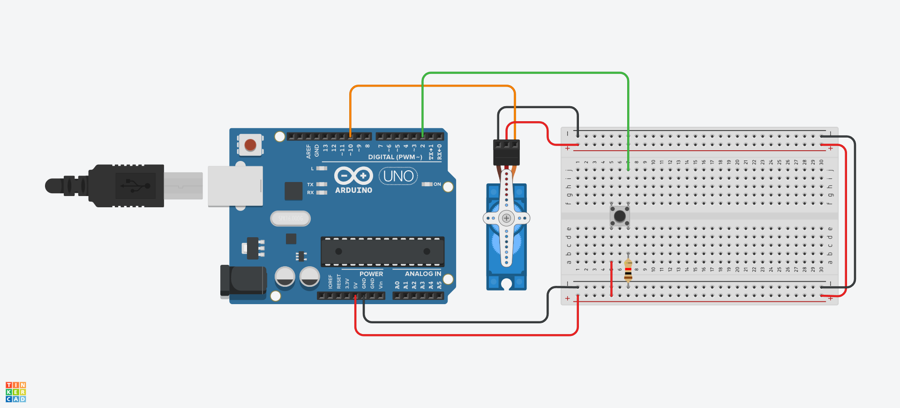

# Servo_with_button
Servo motor turns with the button

1. 준비물
>아두이노, 브래드보드, 서보모터 1개, 버튼 1개, 저항 1개, 점퍼선

2. 동작
>버튼을 누를 때마다 서보모터가 150도 회전한다.

3. attachInterrupt()
>RISING 모드를 이용해서 LOW에서 HIGH로 변할 때 인터럽트가 발생하도록 함(스위치를 누르면 HIGH)
